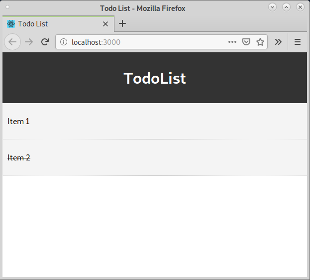
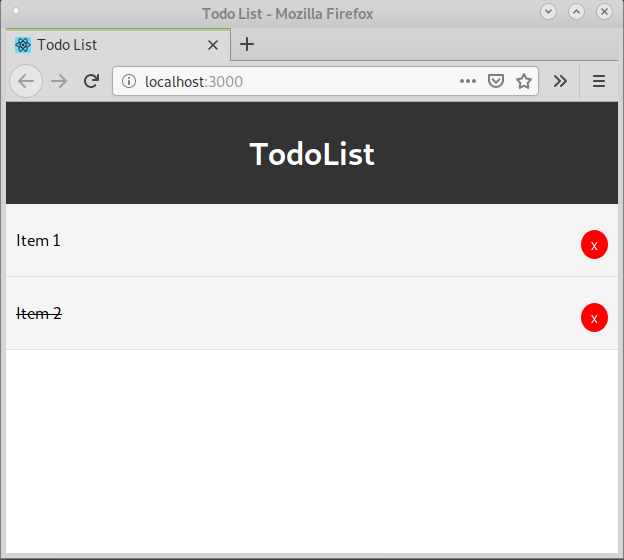
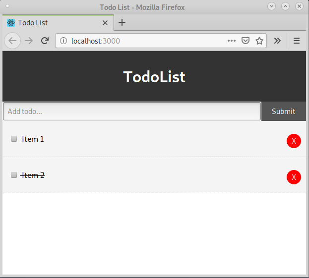
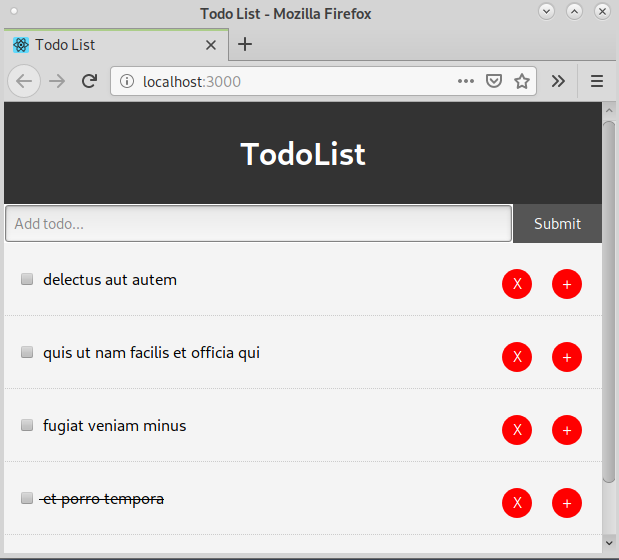

# Zadanie do wykonania
Celem zadania będzie utworzenie przy pomocy Reacta prostej aplikacji pozwalającej na robienie notatek z rzeczy do zrobienia w wolnym czasie.

## Przygotowanie środowiska 

### Instalacja npm

Do uruchomienia aplikacji oraz przygotowania środowiska konieczny będzie manager pakietów `npm`. Jest on już zainstalowany w wystarczającej do przeprowadzenia tego ćwiczenia wersji na maszynach, których używaliśmy podczas zajęć. Gdyby ktoś chciał zainstalować go na prywatnym komputerze, może go pobrać ze [strony](https://nodejs.org/en/).

 
### Utworzenie szkieletu aplikacji przy pomocy npx
npx (package runner dla npm) posiada polecenie ```create-react-app```, które tworzy szkielet aplikacji reacta. By przyśpieszyć ten proces oraz ułatwić pracę nad zadaniem, 
folder  `todo_list` zawiera już utworzone pliki, z których pozbyto się części rzeczy nieprzydatnych dla tego zadania w celu jego uproszczenia.
 
Zawartość tego folderu powstała w wyniku wywołania polecenia:


```npx create-react-app todo_list```


### Zainstalowanie potrzebnych pakietów 
Przed przystąpieniem do edytowania kodu, potrzebne będzie zainstalowanie używanych przez React pakietów, ich lista znajduję się w pliku ```todo_list/package.json```. 
Należy przejść do katalogu ```todo_list``` oraz wykonać polecenie:

```npm install```

## Uruchomienie serwera
Serwer uruchamiamy poleceniem:
```npm start```

Pod adresem:
```http://localhost:3000```
znajduję się aktualnie uruchomiona wersja aplikacji. Każde zapisane zmiany programu powinny na żywo zaktualizować stronę.


## Dodanie pierwszego komponentu:

Tworzymy nowy podkatalog w katalogu ```src``` o nazwie ```components```. Każdy komponent umieścimy w osobnym pliku js będącym jego nazwą (i zaczynającym się z dużej litery).

Tworzymy pierwszy komponent o nazwie ```Header.js``` i umiesczamy go w katalogu ```src/components```. 

Kod komponentu jest następujący:

```
import React from 'react';

function Header() {
    return (
        <header style={headerStyle}>
            <h1> TodoList </h1>
        </header>
    );
} 

const headerStyle = {
    background: '#333',
    color: '#fff',
    textAlign: 'center',
    padding: '10px'
}

export default Header;
```

Jest to bardzo prosty komponent, który nie posiada żadnej konkretnej logiki. Reprezentuje on nagłówek dokumentu. Pokazany przykład ilustruje użycie kodu JS (zawierającego zmienna ze stylem) wstrzykniętego do widoku JSX, który zostaje zwrócony przez funkcję. Funkcja o nazwie ```Header``` jest więc prostym komponentem funkcyjnym. Identyczny komponent zrealizowany przy pomocy klasy z metodą ```render()``` wyglądałby następująco:

```
import React from 'react';

class Header extends React.Component {
    headerStyle = {
        background: '#333',
        color: '#fff',
        textAlign: 'center',
        padding: '10px'
    }
    
    render() {
        return (
            <header style={this.headerStyle}>
                <h1> TodoList </h1>
            </header>);
    }
} 

export default Header;
```


Utworzony komponent umieszczamy w głównym komponencie ```App```, który znajduję się w przygotowanym już pliku ```App.js```.

```
import React from 'react';
import Header from './components/Header';

function App() {
  return (
    <div className="App">
      <Header />
    </div>
  );
}

export default App;
```

## Utworzenie komponentu odpowiedzialnego za wyświetlenie pojedynczego zadania
Czas na utworzenie komponentu, który będzie odzwierciedlał pojedyncze zadanie. Oto kod pierwszej wersji komponentu ```TodoItem.js```, który umieszczamy w tym samym katalogu co poprzedni komponent.

```
import React, { Component } from 'react';
import PropTypes from 'prop-types';

class TodoItem extends Component {
    getStyle = () => {
        return {
            background: '#f4f4f4',
            padding: '10px',
            borderBottom: '1px #ccc dotted', 
            textDecoration: this.props.todo.completed ? 'line-through' : 'none'
        }
    }
    
    render() {
        return (
            <div style={this.getStyle()}>
                <p> { this.props.todo.title} </p>            
            </div>
        )
    }

}

TodoItem.propTypes = {
    todo: PropTypes.object.isRequired
}

export default TodoItem;
```

Kod komponentu jest na razie bardzo prosty, zawiera szablon ```propTypes```, który informuje, że komponent potrzebuje do działania obiektu ```todo```. Sam komponent posiada jedną prostą metodę - dopasowuje ona wygląd taska w zależności czy zmienna obiektu ```todo.completed``` jest prawdą czy nie (jeżeli zadanie jest zakończone to tekst jest przekreślony). Posiada również metodę ```render```, która tworzy element o danym tytule.
 
Potrzeba jednak użyć tego komponentu, by sprawdzić czy działa, do tego celu wrzucimy go chwilowo do wnętrza komponentu ```App```, tak jak zrobiliśmy to poprzednio z ```Header```. Proszę nie zapomnieć o poprawnym dołączeniu pliku.

```
function App() {
  return (
    <div className="App">
      <Header />
      <TodoItem todo={todoItems[0]} />
      <TodoItem todo={todoItems[1]} />
    </div>
  );
}

const todoItems = [{
  id: 1,
  title: "Item 1", 
  completed: false
},
{
  id: 2,
  title: "Item 2", 
  completed: true
},
];
```
 
Dodano również testowy obiekt, który przechowuje dwa zadania (jedno ukończone, drugie nie). Aplikacja powinna wyglądać tak: 

 
 
## Dodanie stanu do aplikacji
Docelowo pragniemy by nasze zadania można było dodawać, zapisywać oraz edytować. By zrealizować takie funkcje w naszej aplikacji konieczne będzie posłużenie się stanem. W następnym kroku odświeżyć więc trochę komponent ```App```.
 


```
class  App extends React.Component {
  state = {
    todos: [{
      id: 1,
      title: "Item 1", 
      completed: false
    },
    {
      id: 2,
      title: "Item 2", 
      completed: true
    },
    ]
  };

  render() {
    return (
    <div className="App">
      <Header />
      <TodoItem todo={this.state.todos[0]} />
      <TodoItem todo={this.state.todos[1]} />
    </div>
  );
  }
}

```

 
Zamieniliśmy więc funkcję na klasę z metodą ```render()``` oraz przenieśliśmy ```todoItems``` do pola ```todos```.
 
W następnym kroku stworzymy metody pozwalające na edycję ```state```.
 
## Usuwanie zadań
Pierwszą z operacji na naszych zadaniach będzie możliwość ich usuwania. Zanim jednak się za to zabierzemy, powinniśmy generalizować operację renderowania poszczególnych zadań. W ```App.js```
zmieniamy następujące linijki:


```
<div className="App">
    <Header />
    <TodoItem todo={this.state.todos[0]} />
    <TodoItem todo={this.state.todos[1]} />
</div>
```

Na:

```
<div className="App">
    <Header />
    { this.state.todos.map((todo) => (<TodoItem todo={todo}/>))}
</div>
```

Dzięki temu niezależnie od ilości zadań, wyrenderowana zostanie poprawną ich ilość. Teraz możemy zabrać się za ich usuwanie.

Do klasy ```App.js``` dodajemy następującą metodę:

```
deleteTodo = (id) => {
    this.setState({ todos: [...this.state.todos.filter(todo => todo.id !== id)]});
}
```

 
Wykorzystuje ona metodę ```setState``` do zaktualizowania stanu o mapę z odfiltrowanymi zadaniami o przekazanym jako argument ```id```. Do przetestowania działania potrzebowalibyśmy jednak jeszcze jakiegoś przycisku.
 
W tym celu aktualizujemy metodę `render()` komponentu `TodoItem.js` o przycisk. 
Kod dla metody oraz przykładowy styl dla przycisku znajduje się poniżej:


```
btnStyle = {
        background: '#ff0000',
        color: '#fff', 
        border: 'none',
        padding: '5px 10px',
        borderRadius: '50%', 
        cursor: 'pointer', 
        float: 'right'
    };

    render() {
        return (
            <div style={this.getStyle()}>
                <p> { this.props.todo.title} 
                <button  onClick={this.props.deleteTodo.bind(this, this.props.todo.id)}  style={this.btnStyle}>x</button> 
                </p>     
            </div>
        )
    }
```

W kodzie istotne jest połączenie metody `onClick` przycisku z metodą `deleteTodo`. Dzieję się to poprzez zbindowanie metod.

Na poniższym obrazku przedstawiono wygląd aplikacji po dodaniu nowego przycisku


## Oznaczanie zadań jako wykonanych 
Wykonamy drugie zadanie, polegające na zmienianiu stanu, tym razem będziemy oznaczać zadania jako wykonane lub nie.


Tworzymy metodę `markTodoAsCompleted` w klasie `App.js`:
```
markTodoAsCompleted = (id) => {
    this.setState({
      todos: this.state.todos.map(todo => { 
        if (todo.id === id)
          todo.completed = !todo.completed;
        return todo;
            })
    });
  }
```

Oraz dodajemy połączenie z naszym zadaniem:
```
{ this.state.todos.map((todo) => (<TodoItem deleteTodo={this.deleteTodo}  markTodoAsCompleted={this.markTodoAsCompleted} todo={todo}/>))}

```

Oraz checkboxa i odpowiednie mapowanie:

```
<p> 
    <input type="checkbox" checked={this.props.todo.completed} onChange={this.props.markTodoAsCompleted.bind(this, this.props.todo.id)} /> {' '}
    { this.props.todo.title} 
    <button  onClick={this.props.deleteTodo.bind(this, this.props.todo.id)}  style={this.btnStyle}>
     X
    </button> 
</p>     
```

 
Ustawiamy  właściwość `checked`, tak by zależała od statusu zadania oraz dodajemy mapowanie w `onChange`, po to by zazneczenie checkboxa skreślało i zmieniało status danego zadania.


## Dodawanie zadań
W tym punkcie utworzymy nowy komponent, którego celem będzie dodawanie nowych zadań:

W tym celu tworzymy kolejny komponent w tym samym miejscu, o nazwie `AddTodoItem.js`.

Jego kod jest następujący:

```
import React, { Component } from 'react';

export class AddTodoItem extends Component {
    
    state = {
        title: ''
    }
    onInputChange = (e) => this.setState({[e.target.name] : e.target.value});
    
    onInputSubmit = (e) => {
        e.preventDefault();
        this.props.addTodoItem(this.state.title);
        this.setState({ title: ''});
    }

    render() {
        return (
            <form onSubmit={this.onInputSubmit} style={{display: 'flex' }}> 
                <input type="text" name="title" placeholder="Add todo..." style={{flex: '10', padding: '5px' }} value={this.state.title} onChange={this.onInputChange}/>
                <input type="submit" value="Submit" className="btn" style={{flex: 1}} />
            </form>
        )
    }
}

export default AddTodoItem;
```

Jest to prosty form posiadający pole tekstowe, którego odzwierciedleniem jest pole `title` w `state`. Istotne jest zdefiniowanie `onInputChange`, które będzie aktualizowało nasz stan gdy użytkownik wpisze zawartość do formularza oraz `onInputSubmit`, które wykonan akcję po wciśnięciu submit.


Style dla przycisku (plik `index.css`):

```
.btn {
  display: inline-block;
  border: none;
  background: #555;
  color: #fff;
  padding: 10px 20px;
  cursor: pointer;
}


.btn:hover {
  background: #666;
}
```


Musimy jeszcze dodać odpowiednią funkcjonalność w ramach aplikacji po wciśnięciu submit.
W klasie `App.js` dodajemy metodę, która przejmie `title` i wypisze je do konsoli.

```
 addTodoItem = (title) => {
    console.log(title);
  }
```

Trzeba również dodać nasz komponent do komponentu zbiorczego:

```
<div className="App">
    <Header />
    <AddTodoItem addTodoItem={this.addTodoItem} />
    { this.state.todos.map((todo) => (<TodoItem key={todo.id} deleteTodo={this.deleteTodo}  markTodoAsCompleted={this.markTodoAsCompleted} todo={todo}/>))}
</div>
```

Aplikacja powinna wyglądać następująco



Możemy utworzyć prostą funkcję, która dodawać będzie nowe zadanie bazując na maksymalnym `id`:

```
addTodoItem = (title) => {
  //console.log(title);
  var newId = Math.max.apply(Math, this.state.todos.map(function(o) {
    return o.id;
  })) + 1;
  const newTodo = {
    id: newId, 
    title,
    completed: false
  };
  this.setState({todos: [...this.state.todos, newTodo]});
}
```

## Wykorzystanie REST

 
Oczywiście dodawane zadania oraz stan są tylko tymczasowe i znikną po odświeżeniu strony. Nie jest to jednak nic dziwnego, gdyż React jest biblioteką służącą do tworzenia interfejsów. Zrobiliśmy więc wszystko w kwestii naszego interfejsu, teraz czas by stworzyć serwis, który pozwoli nam na zachowanie danych. W tym celu utworzymy jako zadanie domowe serwis REST pozwalający na dodawanie zadań, wczytywanie oraz usuwanie.
 
 
Ten rozdział pokazuje jak obsłużyć REST od strony React. 
 
 
Do tego celu wykorzystamy mockup dostępny w serwisie https://jsonplaceholder.typicode.com/todos. Odwołanie do tego endpointa zwraca JSON takiego formatu:


```
[
  {
    "userId": 1,
    "id": 1,
    "title": "delectus aut autem",
    "completed": false
  },
  ...
  }
]
```

Zbędne pole `userId` możemy zignorować. Do wypełnienia początkowych zadań wykorzystamy metody cyklu życia React, w tym przypadku ```componentDidMount```, która wykonuję się dokładnie raz.

Czyścimy więć dane przechowywane w `state` oraz dodajemy metodę do `App.js`:
```
  state = {todos: []};

  componentDidMount() {
    fetch('https://jsonplaceholder.typicode.com/todos')
    .then(res => res.json())
    .then((data) => {
      this.setState({ todos: data.slice(0, 5) })
    })
    .catch(console.log)
  }
```
Wywołanie `fetch('https://jsonplaceholder.typicode.com/todos')` wykona zapytanie GET do zadanego endpointa, natomiast `.then(res => res.json())` zamieni wynik na JSON, który zostanie zapisany do naszego `state` w poleceniu `.then((data) => { this.setState({ todos: data.slice(0, 5) })})`. Zapisane zostaje tylko 5 pierwszych wyników, cała lista zawiera aż 200 rekordów. Gdy dodajemy połączenie do własnej bazy najlepiej pobierać wszystkie wyniki, jednak w przypadku danych przykładowych 5 rekordów wystarczy.

## Dodanie React Router

W ramach dalszego rozwoju zadania zostanie dodany do aplikacji React Router, który umożliwi nawigację pomiędzy widokami. Dodany zostanie komponent do modyfikacji treści zadania, którego uzupełnienie będzie zadaniem domowym. Teraz skupimy się na dodaniu nawigacji.

Na początku należy dodać odpowniedni pakiet:
```
npm install --save react-router
```

Dodajemy prosty komponent `EditTodoItem`:

```
import React from 'react';

class EditTodoItem extends React.Component {

    render() {
        return (
            <div>
              <h1> Edit item {this.props.match.params.id}</h1>
            </div>);
    }
} 

export default EditTodoItem;
```

Z `props` wydobywany jest argument z adresu, który jest id elementu.

W `TodoItem.js` w metodzie `render` dodajemy przycisk - `Link`, który po kliknięciu przekieruje do nowego komponentu `EditTodoItem`:

```
import {Link} from 'react-router-dom'

...

    btnStyle = {
        background: '#ff0000',
        color: '#fff', 
        border: 'none',
        padding: '5px 10px',
        margin: 'auto 10px',
        borderRadius: '50%', 
        cursor: 'pointer', 
        float: 'right',
        width: '30px',
        height: '30px',
    };

    linkStyle = {
        ...this.btnStyle, 
        textDecoration: 'none',
        width: 'auto',
        height: 'auto',
    };

...

    <Link to={'/' + this.props.todo.id} style={this.linkStyle}>+</Link> 
    <button onClick={this.props.deleteTodo.bind(this, this.props.todo.id)}  style={this.btnStyle}>X</button>

```
Zostały też dodane style do nowego przycisku.

Dodany został również komponent zawierający listę wszystkich todo oraz obsługę zdarzeń, przeniesioną z komponentu `App`:

```
import React from 'react';
import TodoItem from './TodoItem';

class TodoList extends React.Component {
    state = {todos: []};

    componentDidMount() {
      fetch('https://jsonplaceholder.typicode.com/todos')
      .then(res => res.json())
      .then((data) => {
        this.setState({ todos: data.slice(0, 5) })
      })
      .catch(console.log)
    }
  
    deleteTodo = (id) => {
      this.setState({ todos: [...this.state.todos.filter(todo => todo.id !== id)
      ]});
    }
  
    markTodoAsCompleted = (id) => {
      this.setState({
        todos: this.state.todos.map(todo => { 
          if (todo.id === id)
            todo.completed = !todo.completed;
          return todo;
              })
      });
    }

    render () {
        const todoList = this.state.todos && this.state.todos.map( todo => {
            return (
                <TodoItem key={todo.id} 
                    deleteTodo={this.deleteTodo} 
                    markTodoAsCompleted={this.markTodoAsCompleted} 
                    todo={todo} />
            )
        });

        console.log(todoList);

        return (
            <div>
                {todoList}
            </div>
        );
    }
    
}

export default TodoList;

```

Ostatnim etapem będzie dodanie do pliku `App.js` obsługi routowania. Po zmianach plik wygląda następująco:
```
import React from 'react';
import { BrowserRouter, Switch, Route } from 'react-router-dom'
import Header from './components/Header';
import AddTodoItem from './components/AddTodoItem';
import EditTodoItem from './components/EditTodoItem';
import TodoList from './components/TodoList';

class App extends React.Component {

  addTodoItem = (title) => {
    //console.log(title);
    var newId = Math.max.apply(Math, this.state.todos.map(function(o) {
      return o.id;
    })) + 1;
    const newTodo = {
      id: newId, 
      title,
      completed: false
    };
    this.setState({todos: [...this.state.todos, newTodo]});
  }

  render() {
    return (
      <BrowserRouter>
        <div className="App">
          <Header />
          <AddTodoItem addTodoItem={this.addTodoItem} />
          <Switch>
            <Route path='/:id' component={EditTodoItem} />
            <Route path='/' component={TodoList} />} />
        </Switch>
        </div>
      </BrowserRouter>
    );
  }
}


export default App;

```

Po wprowadzonych zmianach po naciśnięciu przycisku `+` przechodzimy do widoku edycji zadania.

Wygląd aplikacji jest następujący:



## Dodanie redux
Ostatnią częścią zadania będzie dodanie centralnego magazynu danych. Rozpoczynamy od stworzenia nowego folderu `store`. Będzie on zawierał wszystkie potrzebne elementy związane z magazynem.

Należy również zainstalować odpowiednie pakiety:

```
npm install --save react-redux
npm install --save redux
npm install --save redux-thunk
```

### Dodanie magazynu

Tworzymy plik `store/rootReducer.js`, który będzie zawierał magazyn:
```
const initialState = {
    todos : []
}

const rootReducer = (state = initialState, action) => {
    return state;
}

export default rootReducer;

```

Stan początkowy to pusta lista.


Następnie w pliku `index.js` należy stworzyć instancję magazynu i przekazać ją do aplikacji:

```
import {createStore, applyMiddleware} from 'redux';
import {Provider} from 'react-redux'
import rootReducer from './store/rootReducer';
import thunk from 'redux-thunk'

const store = createStore(rootReducer, applyMiddleware(thunk));

ReactDOM.render(
  <Provider store={store}>
      <App />
  </Provider>,
  document.getElementById('root')
);
```

Ponieważ nasza aplikacja zawiera zapytania REST oparte asynchronicznych wywołaniach potrzebne jest pośrednie oprogramowanie `redux-thunk`. Umożliwia ono kreatorom akcji zwrócenie funkcji zamiast akcji i może zostać wykorzystane do wykonywania asynchronicznych czynności, takich jak zapytania `fetch`.

### Połączenie listy z magazynem

Aby pobierać dane z magazynu zamiast ze stanu komponentu należy na początek połączyć komponent z magazynem za pomocą funkcji `connect`:

```
import {connect} from 'react-redux'

...

export default connect()(TodoList);

```

Następnym etapem będzie dodanie funkcji mapującej stan magazynu na atrybuty komponentu:

```
const mapStateToProps = (state) => {
    return {
        todos: state.todos,
    };
}

export default connect(mapStateToProps)(TodoList);
```

Należy pamiętać, aby przekazać ją jako argument funkcji `connect`. Ostatnią czynnością będzie zamienienie listy ze stanu na informacje pobierane z atrybutów.

```
const todoList = this.props.todos && this.props.todos.map( todo => ...

```

Wyświetlana jest teraz pusta lista (zgodnie ze stanem początkowym). Dane w funkcji `componentDidMount` pobierane są dalej do stanu komponentu. Następnym etapem będzie dodanie odpowiednich akcji do modyfikowania listy.

### Dodanie akcji

Dodawanie akcji rozpoczniemy od dodania nowego pliku `store/rootActions.js`. Konieczne będą cztery czynności: pobranie rekordów z bazy, dodanie zadania, usunięcie zadania oraz zaznaczenie zadania jako wykonane.

```
// akcje
export const GET_TODOS = 'GET_TODOS'
export const ADD_TODO = 'ADD_TODO'
export const DEL_TODO = 'DEL_TODO'
export const COMPLETE_TODO = 'COMPLETE_TODO'

```

Następnie należy zaimplementować kreatory akcji:

```
// pobranie rekordów z bazy
export const getTodos = () => {
    return (dispatch) => {
        fetch('https://jsonplaceholder.typicode.com/todos')
        .then(res => res.json())
        .then((data) => {
            dispatch({type: GET_TODOS, todos: data.slice(0, 5)});   
        })
        .catch(console.log)
    }
}

export default getTodos;

```

Czynności wykonywane w tej akcji zostały przeniesione z funkcji `componentDidMount` komponentu `TodoList`.

Magazyn musi odpowiednio zareagować na podaną akcję - ustawić nową listę `todos`:

```
import GET_TODOS from './rootActions.js'

...

const rootReducer = (state = initialState, action) => {
    switch(action.type){
        case GET_TODOS: {
            return {
                ...state,
                todos: action.todos
            };
        }
        default: {
            return state;
        }
    }
}

```

Ostatnim etapem będzie dodanie akcji do komponentu. Modyfikujemy plik `TodoList.js`:

```
import {getTodos} from '../store/rootActions.js'

...

const mapDispatchToProps = (dispatch) => {
    return {
        getTodos: () => {dispatch(getTodos())} 
    };
}

export default connect(mapStateToProps, mapDispatchToProps)(TodoList);

```

Dzięki wprowadzonym modyfikacjom lista zadań jest wyświetlana, jednak wciąż nie działają pozostałe funkcjonalności - należy dodać odpowiednie kreatory, zmapować je w komponencie oraz dodać odpowiednie rekacje w magazynie.

Przykładowy kreator do zaznaczania zadania jako wykonane:

```
export const completeTodos = (id) => {
    return {
        type: COMPLETE_TODO,
        id
    }
}

```

oraz reakacja magazynu danych:
```
  case COMPLETE_TODO: {
      const todoId = action.id;

      // stan zmieniamy przez zwrócenie nowego stanu, nie przez modyfikację starego
      // funkcje find i filter nie naruszają orgnalnej tablicy
      let todos = state.todos.filter(todo => {
          return todo['id'] !== todoId
        })

      let todo = state.todos.find(todo => {
          return todo['id'] === todoId
        }) 
        
      todo.completed = !todo.completed;
      return {
          ...state,
          todos: [ ...todos, todo ]
      };
  }

```

Po dodaniu wszystkich akcji komponent nie powinien mieć już żadnych czynności związanych z jego stanem, można więc go usunąć. 

## Zadanie domowe:
 * Zaimplementować pozostałe akcje: dodaj, usuń oraz zaznacz jako wykonane
 * Dokonać edycji komponentów, tak by można było zmienić treść wybranego zadania.
 * Utworzenie własnego serwisu REST, który będzie pozwalał wykonywać operacje na zadaniach jako obiektach JSON. Realizacja w postaci dowolnej poznanej na zajęciach technice (na przyklad przy pomocy Spring). Baza danych dowolna, wymagana implementacja dodawania, usuwania oraz edycji (zaznaczanie zadań wykonanych).

